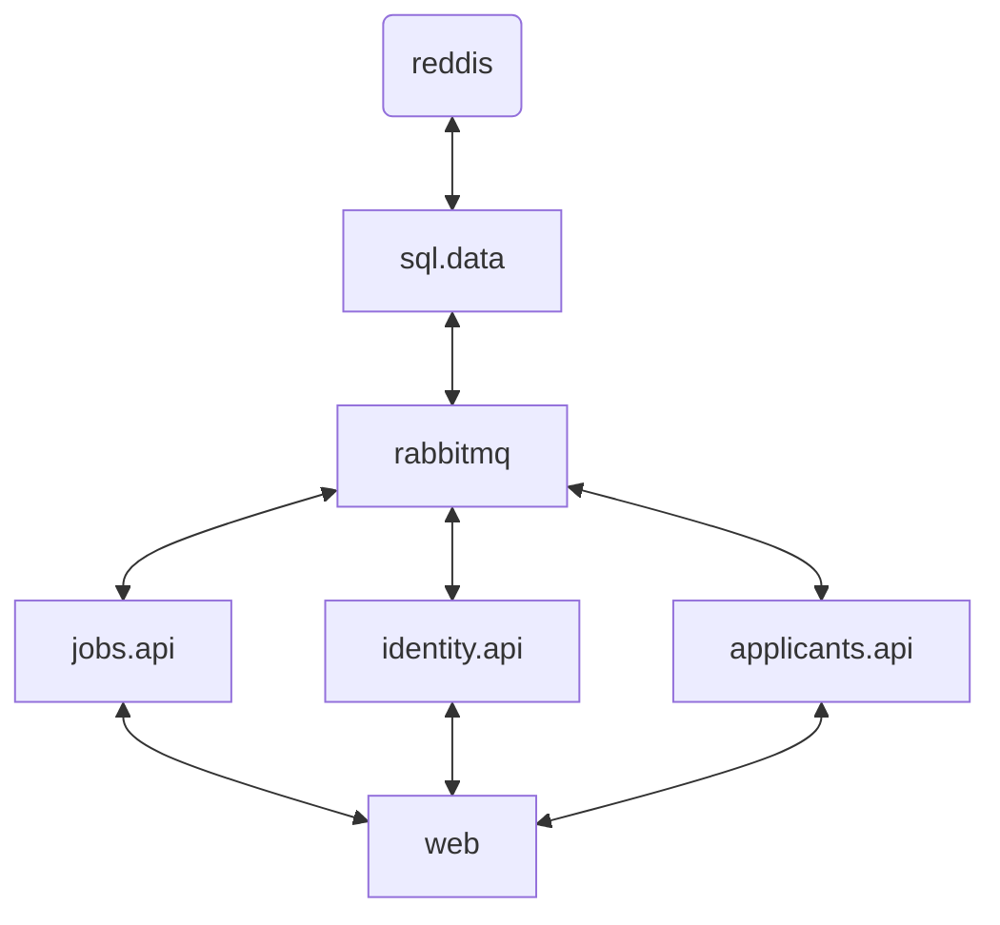

#   Build a Docker Image :
Building a docker image

```sh
docker build -t NAME .
``` 

```sh
docker build -t alaahajri/web:1 -f ./Dockerfile.web .
docker push alaahajri/web:1
docker tag web alaahajri/web:1
``` 

Here is a simple flow chart:


